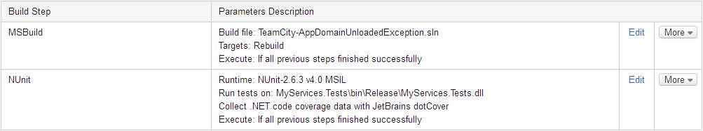
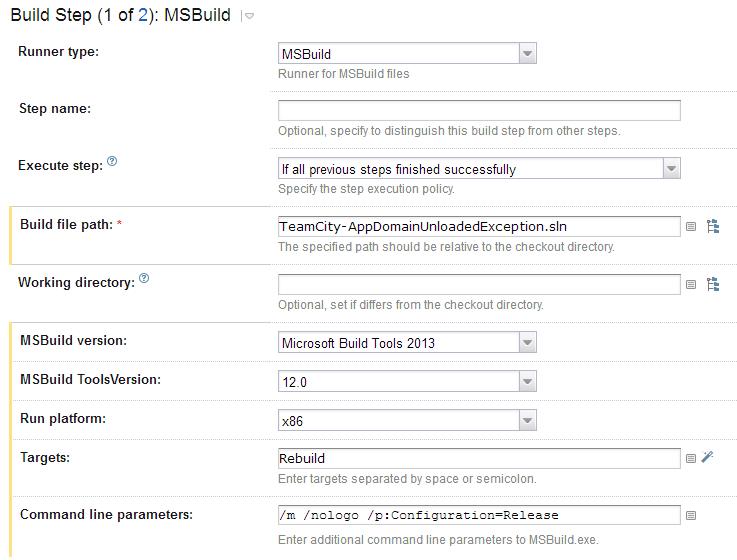
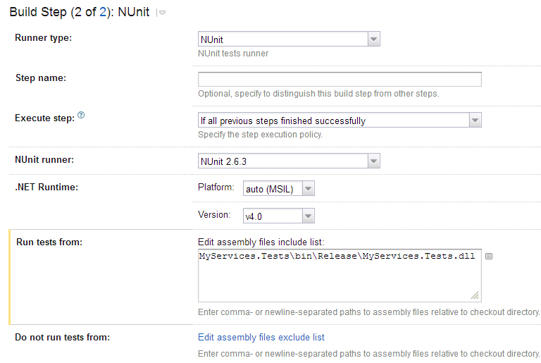

# TeamCity NUnit Test Runner AppDomainUnloadedException

---

## Build configuration







## Build log
```
Build 'Playground :: TeamCity Error Repro' #8 
Started 'Wed Sep 10 01:15:22 ADT 2014' on 'cap-build01-agent01' by 'C. Augusto Proiete'
Finished 'Wed Sep 10 01:16:38 ADT 2014' with status 'NORMAL Tests passed: 3'
TeamCity URL https://teamcity.augustoproiete.net/viewLog.html?buildId=71067&buildTypeId=Playground_TeamCityErrorRepro 
TeamCity server version is 8.1.4 (build 30168)

[01:15:21] : bt285 (1m:16s)
[01:15:21] : TeamCity server version is 8.1.4 (build 30168)
[01:15:21] : Checking for changes (running for 1m:16s)
[01:15:21] : Will collect changes in 1 VCS roots
[01:15:21] : Loading current repository state for VCS root 'github.com'
[01:15:22] : Waiting for completion of current operations for the VCS root 'github.com'
[01:15:22] : Detecting changes in VCS root 'github.com' (used in TeamCity Error Repro)
[01:15:22] : Agent time zone: America/Halifax
[01:15:22] : Agent is running under JRE: 1.6.0_31-b05
[01:15:22] : Publishing internal artifacts
[01:15:22] :	 [Publishing internal artifacts] Sending using ArtifactsCachePublisher
[01:15:22] :	 [Publishing internal artifacts] Sending using WebPublisher
[01:15:22] : Clearing temporary directory: E:\Agent01tmp\buildTmp
[01:15:22] : Checkout directory: E:\Agent01wrk\f551c3b050e9bf6
[01:15:22] : Updating sources: server side checkout (1s)
[01:15:22] :	 [Updating sources] Using vcs information from agent file: f551c3b050e9bf6.xml
[01:15:23] :	 [Updating sources] Will perform clean checkout. Reason: "Clean all files before build" turned on
[01:15:23] :	 [Updating sources] Building clean patch for VCS root: github.com
[01:15:23] :	 [Updating sources] Repository sources transferred: 840.1 KB total
[01:15:24] :	 [Updating sources] Removing E:\Agent01wrk\f551c3b050e9bf6
[01:15:24] :	 [Updating sources] Updating E:\Agent01wrk\f551c3b050e9bf6
[01:15:24] : ##teamcity[buildStatisticValue key='buildStageDuration:sourcesUpdate' value='1708.0']
[01:15:24] : Build preparation done
[01:15:24] : Step 1/2: MSBuild (3s)
[01:15:24] :	 [Step 1/2] ##teamcity[buildStatisticValue key='buildStageDuration:firstStepPreparation' value='77.0']
[01:15:24] :	 [Step 1/2] ##teamcity[buildStatisticValue key='buildStageDuration:buildStepRUNNER_330' value='0.0']
[01:15:24] :	 [Step 1/2] Starting: E:\BuildAgent01\plugins\dotnetPlugin\bin\JetBrains.BuildServer.MsBuildBootstrap.exe /workdir:E:\Agent01wrk\f551c3b050e9bf6 "/msbuildPath:C:\Program Files (x86)\MSBuild\12.0\bin\MSBuild.exe"
[01:15:24] :	 [Step 1/2] in directory: E:\Agent01wrk\f551c3b050e9bf6
[01:15:25] :	 [Step 1/2] TeamCity-AppDomainUnloadedException.sln.teamcity: Build target: TeamCity_Generated_Build
[01:15:25] :		 [TeamCity-AppDomainUnloadedException.sln.teamcity] TeamCity_Generated_Build
[01:15:25] :			 [TeamCity_Generated_Build] MSBuild
[01:15:25] :				 [MSBuild] TeamCity-AppDomainUnloadedException.sln: Build target: Rebuild
[01:15:25] :					 [TeamCity-AppDomainUnloadedException.sln] ValidateSolutionConfiguration
[01:15:25] :						 [ValidateSolutionConfiguration] Building solution configuration "Release|Any CPU".
[01:15:25] :					 [TeamCity-AppDomainUnloadedException.sln] Rebuild
[01:15:25] :						 [Rebuild] MSBuild
[01:15:26] :							 [MSBuild] MyServices\MyServices.csproj: Build target: Rebuild
[01:15:26] :								 [MyServices\MyServices.csproj] CoreClean
[01:15:26] :									 [CoreClean] MakeDir
[01:15:26] :										 [MakeDir] Creating directory "obj\Release\".
[01:15:26] :								 [MyServices\MyServices.csproj] PrepareForBuild
[01:15:26] :									 [PrepareForBuild] MakeDir
[01:15:26] :										 [MakeDir] Creating directory "bin\Release\".
[01:15:26] :								 [MyServices\MyServices.csproj] CoreCompile
[01:15:26] :									 [CoreCompile] Csc
[01:15:26] :										 [Csc] C:\Program Files (x86)\MSBuild\12.0\bin\Csc.exe /noconfig /nowarn:1701,1702 /nostdlib+ /errorreport:prompt /warn:4 /define:TRACE /highentropyva- /reference:"C:\Program Files (x86)\Reference Assemblies\Microsoft\Framework\.NETFramework\v4.0\mscorlib.dll" /reference:"C:\Program Files (x86)\Reference Assemblies\Microsoft\Framework\.NETFramework\v4.0\System.Core.dll" /reference:"C:\Program Files (x86)\Reference Assemblies\Microsoft\Framework\.NETFramework\v4.0\System.dll" /reference:"C:\Program Files (x86)\Reference Assemblies\Microsoft\Framework\.NETFramework\v4.0\System.ServiceModel.dll" /debug:pdbonly /filealign:512 /optimize+ /out:obj\Release\MyServices.dll /target:library /utf8output IMyService.cs MyService.cs Properties\AssemblyInfo.cs "E:\Agent01tmp\buildTmp\.NETFramework,Version=v4.0.AssemblyAttributes.cs"
[01:15:26] :								 [MyServices\MyServices.csproj] CopyFilesToOutputDirectory
[01:15:26] :									 [CopyFilesToOutputDirectory] Copy
[01:15:26] :										 [Copy] Copying file from "obj\Release\MyServices.dll" to "bin\Release\MyServices.dll".
[01:15:26] :									 [CopyFilesToOutputDirectory] MyServices -> E:\Agent01wrk\f551c3b050e9bf6\MyServices\bin\Release\MyServices.dll
[01:15:26] :									 [CopyFilesToOutputDirectory] Copy
[01:15:26] :										 [Copy] Copying file from "obj\Release\MyServices.pdb" to "bin\Release\MyServices.pdb".
[01:15:26] :							 [MSBuild] MyServices.Tests\MyServices.Tests.csproj: Build target: Rebuild
[01:15:26] :								 [MyServices.Tests\MyServices.Tests.csproj] CoreClean
[01:15:26] :									 [CoreClean] MakeDir
[01:15:26] :										 [MakeDir] Creating directory "obj\Release\".
[01:15:26] :								 [MyServices.Tests\MyServices.Tests.csproj] CleanReferencedProjects
[01:15:26] :								 [MyServices.Tests\MyServices.Tests.csproj] PrepareForBuild
[01:15:26] :									 [PrepareForBuild] MakeDir
[01:15:26] :										 [MakeDir] Creating directory "bin\Release\".
[01:15:26] :								 [MyServices.Tests\MyServices.Tests.csproj] ResolveProjectReferences
[01:15:26] :								 [MyServices.Tests\MyServices.Tests.csproj] GenerateTargetFrameworkMonikerAttribute
[01:15:26] :									 [GenerateTargetFrameworkMonikerAttribute] Skipping target "GenerateTargetFrameworkMonikerAttribute" because all output files are up-to-date with respect to the input files.
[01:15:26] :								 [MyServices.Tests\MyServices.Tests.csproj] CoreCompile
[01:15:26] :									 [CoreCompile] Csc
[01:15:26] :										 [Csc] C:\Program Files (x86)\MSBuild\12.0\bin\Csc.exe /noconfig /nowarn:1701,1702 /nostdlib+ /errorreport:prompt /warn:4 /define:TRACE /highentropyva- /reference:"C:\Program Files (x86)\Reference Assemblies\Microsoft\Framework\.NETFramework\v4.0\mscorlib.dll" /reference:E:\Agent01wrk\f551c3b050e9bf6\MyServices\bin\Release\MyServices.dll /reference:E:\Agent01wrk\f551c3b050e9bf6\packages\NUnit.2.6.3\lib\nunit.framework.dll /reference:"C:\Program Files (x86)\Reference Assemblies\Microsoft\Framework\.NETFramework\v4.0\System.Core.dll" /reference:"C:\Program Files (x86)\Reference Assemblies\Microsoft\Framework\.NETFramework\v4.0\System.dll" /reference:"C:\Program Files (x86)\Reference Assemblies\Microsoft\Framework\.NETFramework\v4.0\System.ServiceModel.dll" /debug:pdbonly /filealign:512 /optimize+ /out:obj\Release\MyServices.Tests.dll /target:library /utf8output MyServiceTests.cs Properties\AssemblyInfo.cs "E:\Agent01tmp\buildTmp\.NETFramework,Version=v4.0.AssemblyAttributes.cs"
[01:15:26] :								 [MyServices.Tests\MyServices.Tests.csproj] _CopyFilesMarkedCopyLocal
[01:15:26] :									 [_CopyFilesMarkedCopyLocal] Copy
[01:15:26] :										 [Copy] Copying file from "E:\Agent01wrk\f551c3b050e9bf6\MyServices\bin\Release\MyServices.dll" to "bin\Release\MyServices.dll".
[01:15:26] :										 [Copy] Copying file from "E:\Agent01wrk\f551c3b050e9bf6\packages\NUnit.2.6.3\lib\nunit.framework.dll" to "bin\Release\nunit.framework.dll".
[01:15:26] :										 [Copy] Copying file from "E:\Agent01wrk\f551c3b050e9bf6\MyServices\bin\Release\MyServices.pdb" to "bin\Release\MyServices.pdb".
[01:15:26] :										 [Copy] Copying file from "E:\Agent01wrk\f551c3b050e9bf6\packages\NUnit.2.6.3\lib\nunit.framework.xml" to "bin\Release\nunit.framework.xml".
[01:15:26] :								 [MyServices.Tests\MyServices.Tests.csproj] GetCopyToOutputDirectoryItems
[01:15:26] :								 [MyServices.Tests\MyServices.Tests.csproj] CopyFilesToOutputDirectory
[01:15:26] :									 [CopyFilesToOutputDirectory] Copy
[01:15:26] :										 [Copy] Copying file from "obj\Release\MyServices.Tests.dll" to "bin\Release\MyServices.Tests.dll".
[01:15:26] :									 [CopyFilesToOutputDirectory] MyServices.Tests -> E:\Agent01wrk\f551c3b050e9bf6\MyServices.Tests\bin\Release\MyServices.Tests.dll
[01:15:26] :									 [CopyFilesToOutputDirectory] Copy
[01:15:26] :										 [Copy] Copying file from "obj\Release\MyServices.Tests.pdb" to "bin\Release\MyServices.Tests.pdb".
[01:15:25] :	 [Step 1/2] MSBuild command line parameters contain "/property:" or "/p:". It is recommended to define System Property on Build Parameters instead.
[01:15:26] :	 [Step 1/2] Process exited with code 0
[01:15:27] :	 [Step 1/2] ##teamcity[buildStatisticValue key='buildStageDuration:buildStepRUNNER_330' value='3585.0']
[01:15:27] : Step 2/2: NUnit (29s)
[01:15:27] :	 [Step 2/2] ##teamcity[buildStatisticValue key='buildStageDuration:buildStepRUNNER_331' value='0.0']
[01:15:27] :	 [Step 2/2] Starting: E:\BuildAgent01\plugins\dotnetPlugin\bin\JetBrains.BuildServer.NUnitLauncher.exe #TeamCityImplicit
[01:15:27] :	 [Step 2/2] in directory: E:\Agent01wrk\f551c3b050e9bf6
[01:15:33] :	 [Step 2/2] JetBrains dotCover Console Runner v2.7.2.84. Copyright (c) 2009-2014 JetBrains s.r.o. All rights reserved.
[01:15:40] :	 [Step 2/2] [JetBrains dotCover] Coverage session started [9/10/2014 1:15:40 AM]
[01:15:46] :	 [Step 2/2] Start TeamCity NUnit Test Runner
[01:15:46] :	 [Step 2/2] Running NUnit-2.6.3 tests under .NET Framework v4.0 x64
[01:15:47] :	 [Step 2/2] MyServices.Tests.dll (6s)
[01:15:50] :		 [MyServices.Tests.dll] MyServices.Tests.MyServiceTests.Can_get_answer_via_basic_http (1s)
[01:15:52] :		 [MyServices.Tests.dll] MyServices.Tests.MyServiceTests.Can_get_answer_via_tcp
[01:15:52] :		 [MyServices.Tests.dll] MyServices.Tests.MyServiceTests.Can_get_answer_via_ws_http (1s)
[01:15:54] :	 [Step 2/2] 2014-09-10 01:15:54,436 [4780] WARN  JetBrains.Container.Log4netDefaultLoggerInitializer - Unhandled exception in current domain: System.AppDomainUnloadedException: Attempted to access an unloaded AppDomain., , (null)
[01:15:54] :	 [Step 2/2] 2014-09-10 01:15:54,438 [5384] WARN  JetBrains.Container.Log4netDefaultLoggerInitializer - Unhandled exception in current domain: System.AppDomainUnloadedException: Attempted to access an unloaded AppDomain., , (null)
[01:15:55] :	 [Step 2/2] [JetBrains dotCover] Coverage session finished [9/10/2014 1:15:55 AM]
[01:15:55] :	 [Step 2/2] [JetBrains dotCover] Coverage results post-processing started [9/10/2014 1:15:55 AM]
[01:15:56] :	 [Step 2/2] [JetBrains dotCover] Coverage results post-processing finished [9/10/2014 1:15:56 AM]
[01:15:56] :	 [Step 2/2] ##teamcity[importData type='dotNetCoverage' tool='dotcover' file='E:\Agent01tmp\buildTmp\coverage_dotcover72850628044247098881.data']
[01:15:56] :	 [Step 2/2] Importing data from 'E:\Agent01tmp\buildTmp\coverage_dotcover72850628044247098881.data' (16.24 MB) with 'dotNetCoverage' processor
[01:15:57] :	 [Step 2/2] Process exited with code 0
[01:15:57] :	 [Step 2/2] ##teamcity[buildStatisticValue key='buildStageDuration:buildStepRUNNER_331' value='29550.0']
[01:15:57] : Waiting for 1 service processes to complete
[01:15:57] : Processing 1 coverage report(s)
[01:15:57] : Generating coverage report by dotcover for files: [E:\Agent01tmp\buildTmp\coverage_dotcover72850628044247098881.data]
[01:15:57] : Get dotCover version
[01:15:57] :	 [Get dotCover version] Started dotCover: E:\BuildAgent01\tools\dotCover\dotCover.exe version E:\Agent01tmp\buildTmp\dotCover1621489971538640162Version
[01:15:57] :	 [Get dotCover version] Output: JetBrains dotCover Console Runner v2.7.2.84. Copyright (c) 2009-2014 JetBrains s.r.o. All rights reserved.

[01:15:57] :	 [Get dotCover version] dotCover exited with code: 0
[01:15:57] : Use DotCover 2.7.x commands set
[01:15:57] : Merge dotCover reports (7s)
[01:16:05] :	 [Merge dotCover reports] Started dotCover: E:\BuildAgent01\tools\dotCover\dotCover.exe merge E:\Agent01tmp\buildTmp\dotcover8508092181181554021.xml
[01:16:05] :	 [Merge dotCover reports] Output: JetBrains dotCover Console Runner v2.7.2.84. Copyright (c) 2009-2014 JetBrains s.r.o. All rights reserved.
[JetBrains dotCover] Snapshot merging started [9/10/2014 1:16:04 AM]
[JetBrains dotCover] Source snapshots number: 1
[JetBrains dotCover] Snapshot merging finished [9/10/2014 1:16:04 AM]

[01:16:05] :	 [Merge dotCover reports] dotCover exited with code: 0
[01:16:05] : Remove dotCover snapshot files (6s)
[01:16:11] :	 [Remove dotCover snapshot files] Started dotCover: E:\BuildAgent01\tools\dotCover\dotCover.exe delete E:\Agent01tmp\buildTmp\dotcover1312540084804250035.xml
[01:16:11] :	 [Remove dotCover snapshot files] Output: JetBrains dotCover Console Runner v2.7.2.84. Copyright (c) 2009-2014 JetBrains s.r.o. All rights reserved.

[01:16:11] :	 [Remove dotCover snapshot files] dotCover exited with code: 0
[01:16:11] : Generate dotCover report (7s)
[01:16:19] :	 [Generate dotCover report] Started dotCover: E:\BuildAgent01\tools\dotCover\dotCover.exe report E:\Agent01tmp\buildTmp\dotcover1156576791617578573.xml
[01:16:19] :	 [Generate dotCover report] Output: JetBrains dotCover Console Runner v2.7.2.84. Copyright (c) 2009-2014 JetBrains s.r.o. All rights reserved.
[JetBrains dotCover] Report generation started [9/10/2014 1:16:12 AM]
[JetBrains dotCover] Report generation finished [9/10/2014 1:16:18 AM]

[01:16:19] :	 [Generate dotCover report] dotCover exited with code: 0
[01:16:19] : Generate dotCover HTML report
[01:16:19] : Packing snapshot files (7s)
[01:16:27] :	 [Packing snapshot files] Started dotCover: E:\BuildAgent01\tools\dotCover\dotCover.exe zip E:\Agent01tmp\buildTmp\dotcover3164159366589699514.xml
[01:16:27] :	 [Packing snapshot files] Output: JetBrains dotCover Console Runner v2.7.2.84. Copyright (c) 2009-2014 JetBrains s.r.o. All rights reserved.

[01:16:27] :	 [Packing snapshot files] dotCover exited with code: 0
[01:16:27] : Remove dotCover snapshot files (6s)
[01:16:33] :	 [Remove dotCover snapshot files] Started dotCover: E:\BuildAgent01\tools\dotCover\dotCover.exe delete E:\Agent01tmp\buildTmp\dotcover2897411804960297907.xml
[01:16:33] :	 [Remove dotCover snapshot files] Output: JetBrains dotCover Console Runner v2.7.2.84. Copyright (c) 2009-2014 JetBrains s.r.o. All rights reserved.

[01:16:33] :	 [Remove dotCover snapshot files] dotCover exited with code: 0
[01:16:33] : DotCover statement coverage was: 24 of 24 ( 100.0%)
[01:16:33] : ##teamcity[buildStatisticValue key='CodeCoverageAbsSCovered' value='24.0']
[01:16:33] : ##teamcity[buildStatisticValue key='CodeCoverageAbsSTotal' value='24.0']
[01:16:33] : ##teamcity[buildStatisticValue key='CodeCoverageAbsMCovered' value='6.0']
[01:16:33] : ##teamcity[buildStatisticValue key='CodeCoverageAbsMTotal' value='6.0']
[01:16:33] : ##teamcity[buildStatisticValue key='CodeCoverageAbsCCovered' value='2.0']
[01:16:33] : ##teamcity[buildStatisticValue key='CodeCoverageAbsCTotal' value='2.0']
[01:16:33] : Publishing artifacts
[01:16:33] :	 [Publishing artifacts] Collecting files to publish: [E:\Agent01tmp\buildTmp\coverage2228485429674901619zip\CoverageReport.xml=>.teamcity/.NETCoverage]
[01:16:33] :	 [Publishing artifacts] Publishing using [ArtifactsCachePublisher]
[01:16:34] :	 [Publishing artifacts] Publishing using [WebPublisher]
[01:16:33] : Publishing artifacts (1s)
[01:16:33] :	 [Publishing artifacts] Collecting files to publish: [E:\Agent01tmp\buildTmp\coverage120671282262897936zip\dotCover.snapshot=>.teamcity/.NETCoverage]
[01:16:34] :	 [Publishing artifacts] Publishing using [ArtifactsCachePublisher]
[01:16:35] :	 [Publishing artifacts] Publishing using [WebPublisher]
[01:16:33] : Publishing artifacts (2s)
[01:16:33] :	 [Publishing artifacts] Collecting files to publish: [E:\Agent01tmp\buildTmp\dotCover249957460064122006report\coverage.zip=>.teamcity/.NETCoverage]
[01:16:36] :	 [Publishing artifacts] Publishing using [ArtifactsCachePublisher]
[01:16:36] :	 [Publishing artifacts] Publishing using [WebPublisher]
[01:16:33] : ##teamcity[buildStatisticValue key='buildStageDuration:buildFinishing' value='36316.0']
[01:16:33] : Publishing internal artifacts (3s)
[01:16:37] :	 [Publishing internal artifacts] Sending using ArtifactsCachePublisher
[01:16:37] :	 [Publishing internal artifacts] Sending using WebPublisher
[01:16:38] : ##teamcity[buildStatisticValue key='buildStageDuration:artifactsPublishing' value='4720.0']
[01:16:38] : Build finished
```